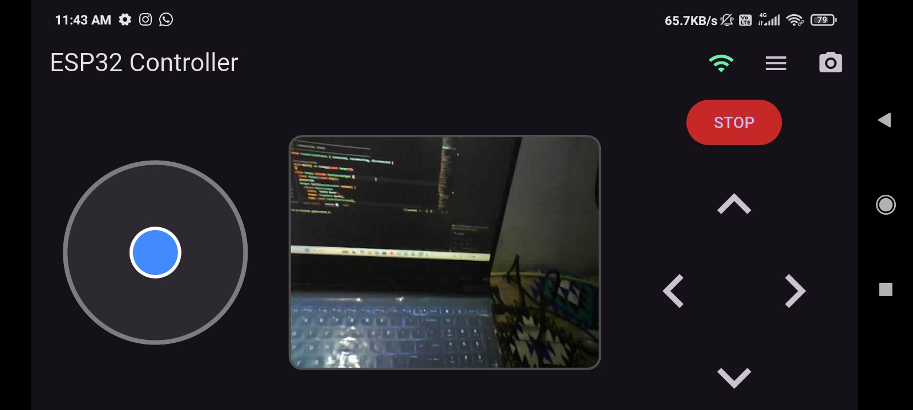
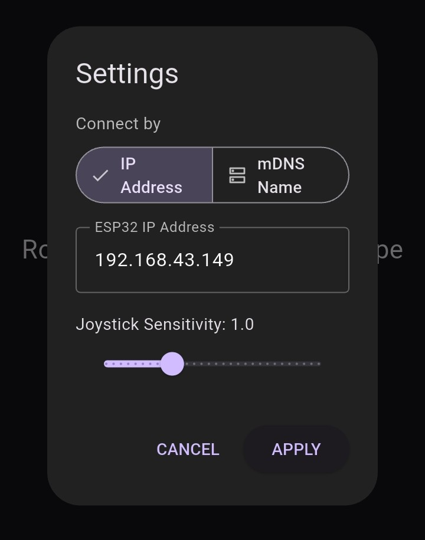
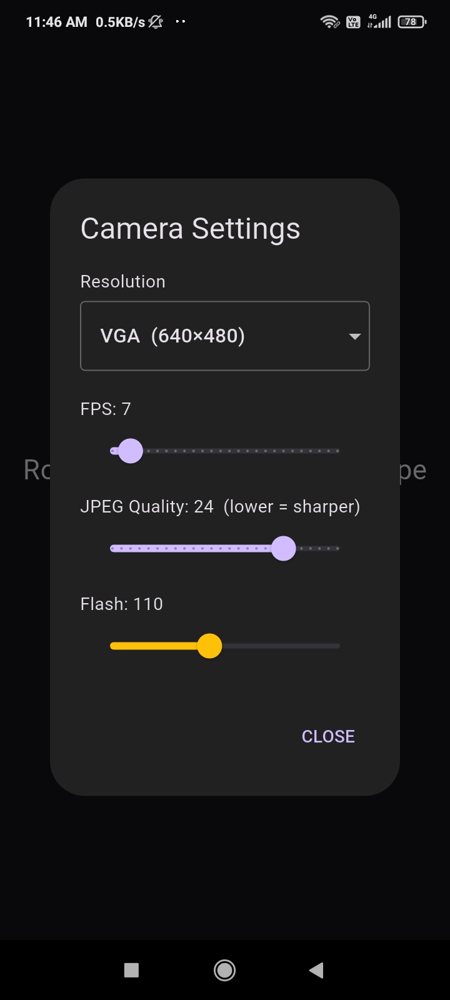
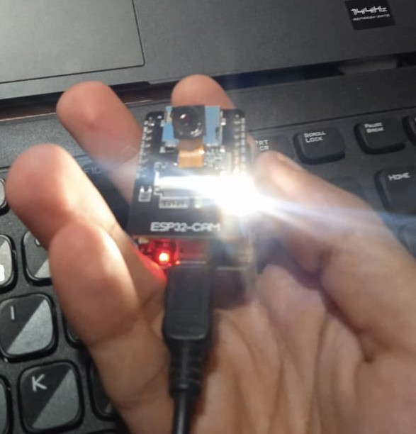

<div align="center">

# ESPController

**Universal ESP32-CAM / ESP32 / ESP8266 WebSocket controller library**

Control any ESP-based device wirelessly via WebSocket — rovers, camera turrets, anything.  
Comes with a Flutter Android app featuring live camera feed, virtual joystick, D-Pad and camera settings.

[](https://github.com/shamilslk/ESPController/releases/latest)
[](LICENSE)
[](.)

</div>

---

## 📸 Screenshots

| D-Pad + Joystick + Camera | Settings | Camera Settings | Flash |
|---|---|---|---|
|  |  |  |  |

---

## ✨ Features

- 🎮 **Virtual joystick** — smooth arcade-drive mixing
- 🕹️ **D-Pad** — Forward / Backward / Left / Right + Emergency Stop
- 📷 **Live camera stream** — real-time JPEG over WebSocket (ESP32-CAM)
- 💡 **Flash LED control** — brightness slider in app
- ⚙️ **Camera settings from app** — FPS, resolution (QVGA/VGA/SVGA), JPEG quality
- 🔄 **Auto reconnect** — app reconnects automatically on drop
- 📶 **RSSI broadcast** — signal quality shown in app every 3 seconds
- 🛡️ **Motor watchdog** — motors stop automatically if app goes silent
- 🚀 **Soft acceleration** — smooth speed ramp instead of jerky starts
- 🌐 **mDNS support** — reach device at `http://devicename.local`
- 🔋 **Battery monitor** — fires callback when voltage drops below threshold

---

## 📱 App

Download the Android app from the [Releases page](https://github.com/shamilslk/ESPController/releases/latest).

The app connects to your ESP device over WiFi and gives you:
- Landscape split-screen layout: Joystick | Camera feed | D-Pad
- Connection status indicator (green/amber/red)
- Settings: change IP address, joystick sensitivity
- Camera settings: resolution, FPS, quality, flash brightness

---

## 🔧 Supported Boards

| Board | Camera | PWM Motors | Flash LED |
|---|---|---|---|
| AI Thinker ESP32-CAM | ✅ | ✅ | ✅ GPIO4 |
| ESP32 DevKit / WROOM | ❌ | ✅ | optional |
| ESP8266 NodeMCU / Wemos D1 | ❌ | ✅ (analogWrite) | optional |

---

## 📦 Installation

### Option A — Manual (ZIP)
1. Click the green **Code** button → **Download ZIP**
2. Arduino IDE → **Sketch → Include Library → Add .ZIP Library**
3. Select the downloaded ZIP

### Option B — Clone
```bash
git clone https://github.com/shamilslk/ESPController.git
```
Copy the `ESPController` folder into your Arduino `libraries/` directory.

---

## 📚 Dependencies

### Board Packages — install via Arduino Boards Manager

| Board | Package | URL |
|---|---|---|
| ESP32 / ESP32-CAM | `esp32` by Espressif | `https://raw.githubusercontent.com/espressif/arduino-esp32/gh-pages/package_esp32_index.json` |
| ESP8266 | `esp8266` by ESP8266 Community | `https://arduino.esp8266.com/stable/package_esp8266com_index.json` |

### Libraries — install via Arduino Library Manager

| Library | Required for |
|---|---|
| **AsyncTCP** by me-no-dev | ESP32 / ESP32-CAM |
| **ESPAsyncTCP** by me-no-dev | ESP8266 |
| **ESPAsyncWebServer** by me-no-dev | All boards |

Everything else (`WiFi`, `esp_camera`, `ESPmDNS`) comes bundled with the board packages.

---

## ⚡ Quick Start

### Step 1 — Pick your board

Open `ESPController.h` and uncomment **exactly one** board:

```cpp
#define BOARD_ESP32CAM    // AI Thinker ESP32-CAM  ← default
// #define BOARD_ESP32    // Any ESP32 without camera
// #define BOARD_ESP8266  // NodeMCU, Wemos D1, etc.
```

Optional — only needed if not using ESP32-CAM:
```cpp
// #define USE_PWM_MOTORS      // PWM speed control (vs simple on/off)
// #define HAS_FLASH_LED
// #define FLASH_LED_PIN  4
// #define HAS_STATUS_LED
// #define STATUS_LED_PIN 33
```
> `BOARD_ESP32CAM` enables `USE_PWM_MOTORS`, `HAS_FLASH_LED` and `HAS_STATUS_LED` automatically.

---

### Step 2 — Write your sketch

```cpp
#include "ESPController.h"

void setup() {
  Serial.begin(115200);

  // WiFi — AP mode creates its own hotspot
  Controller.setWiFi("MY_DEVICE", "12345678");

  // Optional: reach device at http://mydevice.local
  Controller.setMDNS("mydevice");

  // Motor pins — match your wiring
  Controller.setMotorAPins(12, 13);   // left  motor IN1, IN2
  Controller.setMotorBPins(14, 15);   // right motor IN3, IN4

  // Tuning
  Controller.setMaxSpeed(200);                   // 0-255
  Controller.setWatchdogTimeout(500);            // ms
  Controller.setAcceleration(20, 20);            // step, tickMs
  Controller.setMotorTrim(MotorSide::LEFT, 0);   // drift fix

  // D-Pad — state is HIGH when pressed, LOW when released
  Controller.onUp([](uint8_t state) {
    if (state == HIGH) { Controller.setMotorA( 255); Controller.setMotorB( 255); }
    else               { Controller.stopMotors(); }
  });
  Controller.onDown([](uint8_t state) {
    if (state == HIGH) { Controller.setMotorA(-255); Controller.setMotorB(-255); }
    else               { Controller.stopMotors(); }
  });
  Controller.onLeft([](uint8_t state) {
    if (state == HIGH) { Controller.setMotorA(-255); Controller.setMotorB( 255); }
    else               { Controller.stopMotors(); }
  });
  Controller.onRight([](uint8_t state) {
    if (state == HIGH) { Controller.setMotorA( 255); Controller.setMotorB(-255); }
    else               { Controller.stopMotors(); }
  });
  Controller.onStop([](uint8_t state) {
    Controller.emergencyStop();
  });

  // Joystick — arcade drive mixing
  // x: -255 = full left,  +255 = full right
  // y: -255 = full back,  +255 = full forward
  Controller.onJoystick([](int x, int y) {
    Controller.setMotorA(constrain(y + x, -255, 255));
    Controller.setMotorB(constrain(y - x, -255, 255));
  });

  Controller.begin();   // starts WiFi, camera, WebSocket server
}

void loop() {
  Controller.update();  // must be called every loop
}
```

---

### Step 3 — Connect the app

1. On your phone, connect to the `MY_DEVICE` WiFi hotspot (password: `12345678`)
2. Open the ESPController app
3. The app auto-connects to `192.168.4.1`

**Using STA mode** (ESP connects to your router or phone hotspot):
```cpp
Controller.setWiFi("YourRouterSSID", "RouterPassword", ControllerWiFiMode::STA);
```
Then check Serial Monitor for the assigned IP and enter it in the app settings.

---

## 🔌 Wiring

### Motor driver (L298N / L9110S / TB6612)

```
ESP32-CAM GPIO12  →  Left  motor IN1
ESP32-CAM GPIO13  →  Left  motor IN2
ESP32-CAM GPIO14  →  Right motor IN1
ESP32-CAM GPIO15  →  Right motor IN2

Motor driver power  →  separate battery (DO NOT use ESP 3.3V/5V)
Motor driver GND    →  ESP GND  (grounds must be connected)
```

### Safe GPIO pins on AI Thinker ESP32-CAM

These GPIOs are **free** for motors and other use:

| GPIO | Safe to use |
|---|---|
| 12, 13 | ✅ Motor A |
| 14, 15 | ✅ Motor B |
| 2 | ✅ General use |
| 16 | ✅ General use |

**Avoid:** 0, 4, 5, 18, 19, 21, 22, 23, 25, 26, 27, 33, 34, 35, 36, 39 — used by camera, flash, or status LED.

---

## 📖 Full API Reference

### Configuration

| Function | Description |
|---|---|
| `Controller.setWiFi(ssid, pass)` | AP mode — creates hotspot |
| `Controller.setWiFi(ssid, pass, ControllerWiFiMode::STA)` | STA mode — joins router |
| `Controller.setMDNS("name")` | Reach device at `http://name.local` |
| `Controller.setMotorAPins(in1, in2)` | Motor A GPIO pins |
| `Controller.setMotorBPins(in1, in2)` | Motor B GPIO pins |
| `Controller.setMaxSpeed(0-255)` | Global speed cap |
| `Controller.setMotorTrim(MotorSide::LEFT, -100 to +100)` | Fix drift |
| `Controller.setWatchdogTimeout(ms)` | Auto-stop if app goes silent. 0 = disabled |
| `Controller.setAcceleration(step, tickMs)` | Ramp speed. 255 = instant |

### Callbacks

| Callback | When it fires |
|---|---|
| `Controller.onUp(cb)` | `state=HIGH` on press, `state=LOW` auto-fired after 300ms |
| `Controller.onDown(cb)` | same |
| `Controller.onLeft(cb)` | same |
| `Controller.onRight(cb)` | same |
| `Controller.onStop(cb)` | `state=HIGH` on press only |
| `Controller.onJoystick(cb)` | `cb(int x, int y)` — x,y each −255…+255 |
| `Controller.onJoystickRaw(cb)` | `cb(float x, float y)` — x,y each −1.0…+1.0 |
| `Controller.onControllerConnected(cb)` | App control socket connects |
| `Controller.onControllerDisconnected(cb)` | App disconnects (motors already stopped) |
| `Controller.onCameraConnected(cb)` | Camera viewer opens (ESP32-CAM only) |
| `Controller.onCameraDisconnected(cb)` | Camera viewer closes (ESP32-CAM only) |
| `Controller.onLowBattery(pin, mV, cb)` | Voltage on ADC pin drops below threshold |

### Motor helpers

| Function | Description |
|---|---|
| `Controller.setMotorA(speed)` | −255 to +255. Trim + maxSpeed + ramp applied |
| `Controller.setMotorB(speed)` | same for motor B |
| `Controller.stopMotors()` | Gradual stop — respects acceleration ramp |
| `Controller.emergencyStop()` | Instant cut — bypasses ramp, also kills flash |

### Connectivity

| Function | Returns |
|---|---|
| `Controller.getRSSI()` | Signal in dBm (e.g. −65) |
| `Controller.getRSSIQuality()` | 0–100 score |
| `Controller.getStatusJSON()` | Full status as JSON string |

### Lifecycle

| Function | When to call |
|---|---|
| `Controller.begin()` | End of `setup()` |
| `Controller.update()` | Every `loop()` — drives everything |

---

## 🔄 What the library handles automatically

You never write code for these — the library and app handle them together:

| Feature | Detail |
|---|---|
| Flash LED | App camera settings → `flash:180` → library sets brightness |
| Camera FPS | App sends `cam:fps=20` → library applies it |
| Camera resolution | App sends `cam:res=VGA` → QVGA / VGA / SVGA |
| JPEG quality | App sends `cam:quality=10` → library applies it |
| RSSI broadcast | Sends `rssi:-65,q:70` to app every 3 seconds |
| Button auto-release | `LOW` fired automatically 300ms after press |
| Emergency stop | Called automatically on controller disconnect |
| WebSocket cleanup | Stale clients cleaned up every loop |
| mDNS update | `MDNS.update()` called automatically on ESP8266 |
| HTTP fallback | `/up` `/down` `/left` `/right` `/stop` `/joystick` `/cam` `/status` |
| Serial logging | Connect/disconnect/commands printed automatically |

---

## 🧪 Examples

Upload these in order when building a new rover:

| Sketch | What it tests | Hardware needed |
|---|---|---|
| `example1_led_test` | WiFi connects, callbacks fire, app sends commands | Just ESP32-CAM |
| `example2_serial_test` | Joystick + D-Pad values in Serial Monitor | Just ESP32-CAM |
| `example3_single_motor` | One motor direction + speed | Motor driver + 1 motor |
| `example4_two_motors_drift` | Both motors + drift trim | Motor driver + 2 motors |
| `example5_joystick_rover` | Arcade drive + acceleration feel | Motor driver + 2 motors |
| `example6_full_rover` | Everything together — final sketch | Complete rover |
| `example_esp32cam_rover` | Library example for ESP32-CAM | Complete rover |
| `example_esp32_rover` | Library example for plain ESP32 | ESP32 + motors |
| `example_esp8266` | Library example for ESP8266 | ESP8266 + motors |

**Expected Serial Monitor output on boot:**
```
[CTRL] Starting ESPController...
[MOTORS] PWM ready
[WIFI] AP IP: 192.168.4.1
[CAM] OK
[HTTP] Server ready on port 80
[CTRL] Ready
```
Then when app connects:
```
[CTRL] App connected!
```

---

## ❓ Troubleshooting

**Camera init failed / rapid LED blink on boot**
- Wrong board selected in `ESPController.h` — make sure `#define BOARD_ESP32CAM` is set
- Power issue — ESP32-CAM needs a stable 5V supply. USB from PC is often not enough. Use a phone charger or dedicated 5V supply.
- Bad USB cable — try a different cable

**Motors spin wrong direction**
- Swap the two motor wire connections on the terminal block, OR
- Swap the IN1/IN2 pin numbers in `setMotorAPins()`

**Rover drifts left or right**
- One motor is physically faster than the other — normal for cheap motors
- Use `setMotorTrim()` to correct it — see `example4_two_motors_drift`

**App shows disconnected (red icon)**
- Make sure phone is connected to `MY_DEVICE` hotspot, not your home router
- Check IP in app settings matches your ESP IP
- Restart the ESP and reconnect

**Short WiFi range**
- AI Thinker ESP32-CAM has a U.FL/IPEX connector for an external antenna
- Move resistor R21 from PCB antenna side to external antenna side
- Attach a 2.4GHz external antenna — range improves from ~20m to ~80m

---

## 👥 Authors

- **Shamil K**
- **Vismaya P**

## 📄 License

MIT License — see [LICENSE](LICENSE) file for details.
