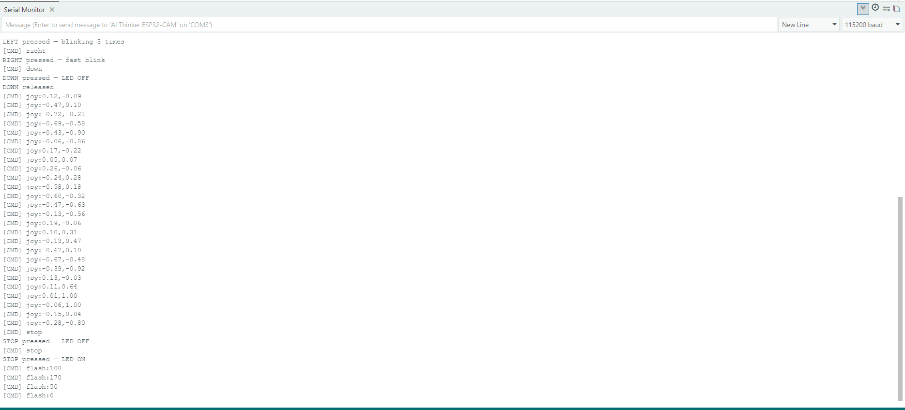

## 📱 Android App
[](https://github.com/shamilslk/ESPController/releases/latest)

# ESPController

A WebSocket + HTTP Arduino library for controlling ESP8266 / ESP32 rover robots from the **ESPController Android app**.

---

## Features

### 🎮 Rover Control
- Virtual joystick → differential drive mixing
- D-Pad controls: Forward / Backward / Left / Right
- Emergency STOP button
- Adjustable motor speed (0–255)

### 📡 Communication
- **WebSocket** control channel — low-latency commands on port 81
- **HTTP fallback** endpoint (`GET /cmd?c=<cmd>`) when WebSocket is unavailable
- Automatic client reconnection handled by the app
- Connection status indicator in the embedded web UI

### 📷 Live Camera Streaming *(ESP32-CAM)*
- Real-time MJPEG video feed via the companion `example_esp32cam_rover` sketch
- WebSocket video transport
- Automatic camera reconnect
- Buffered frame display for smoother streaming

### ⚙️ Camera Settings *(sent from app)*
- Resolution: QVGA (320×240) · VGA (640×480) · SVGA (800×600)
- FPS, JPEG Quality, Flash Brightness

### 🌐 Multiple Connection Methods
| Mode | Address |
|------|---------|
| IP Address | `192.168.4.1` (AP default) |
| mDNS | `espcontroller.local` |

### 📱 Embedded Web UI
- Dark theme
- Landscape-optimised split-screen layout
- Live connection indicator
- Joystick + Camera feed + D-Pad interface

---

## 📸 Screenshots

| D-Pad + Joystick + Camera | IP & Joystick Settings |
|---------------------------|----------------------|
|  |  |

| Camera Settings | Flash Working | Serial Monitor |
|----------------|---------------|----------------|
|  |  |  |

## Installation

### Arduino Library Manager (recommended)
1. Open Arduino IDE → **Sketch → Include Library → Manage Libraries…**
2. Search for `ESPController` and click **Install**.

### Manual
1. Download or clone this repository.
2. Copy the `ESPController` folder into your Arduino `libraries/` directory.
3. Restart the Arduino IDE.

### Dependencies
Install these libraries via Library Manager first:

| Library | Tested version |
|---------|---------------|
| [WebSockets by Markus Sattler](https://github.com/Links2004/arduinoWebSockets) | ≥ 2.3.6 |

---

## Quick Start

```cpp
#include <ESPController.h>

ESPController controller;

// Motor wiring:  in1, in2, en (PWM)
MotorPins leftMotor  = {14, 12, 13};
MotorPins rightMotor = {27, 26, 25};

void setup() {
  Serial.begin(115200);

  controller.setMotorPins(leftMotor, rightMotor);
  controller.setSpeed(200);

  // Start as Access Point — connect to "MyRover" WiFi
  controller.beginAP("MyRover", "12345678");

  Serial.print("Control page: http://");
  Serial.println(controller.localIPString());
}

void loop() {
  controller.handle();  // Must be called every loop
}
```

Open `http://192.168.4.1` in a browser or use the **ESPController app** to drive your rover.

---

## API Reference

### Initialisation

```cpp
// Access Point mode
void beginAP(const char* ssid, const char* password = "",
             uint16_t port = 80, uint16_t wsPort = 81);

// Station mode (join existing WiFi)
bool beginSTA(const char* ssid, const char* password,
              uint32_t timeoutMs = 10000,
              uint16_t port = 80, uint16_t wsPort = 81);

// Must be called in loop()
void handle();
```

### Motor Control

```cpp
void setMotorPins(MotorPins left, MotorPins right);
void setSpeed(uint8_t speed);   // 0–255, default 200

void motorForward();
void motorBackward();
void motorLeft();
void motorRight();
void motorStop();
void motorJoystick(int x, int y);  // -100…+100 each axis
```

### Callbacks

```cpp
// Called on every received command
void onCommand(void (*callback)(char cmd, const String& payload));

void onClientConnect(void (*callback)(uint8_t clientId));
void onClientDisconnect(void (*callback)(uint8_t clientId));
```

### Messaging

```cpp
void sendMessage(uint8_t clientId, const String& msg);
void broadcast(const String& msg);
```

### Status

```cpp
bool      isConnected() const;
uint8_t   connectedClients() const;
IPAddress localIP() const;
String    localIPString() const;
```

---

## Command Protocol

Commands are single-character ASCII, optionally followed by a payload:

| Char | Command  | Payload example |
|------|----------|----------------|
| `F`  | Forward  | — |
| `B`  | Backward | — |
| `L`  | Left     | — |
| `R`  | Right    | — |
| `S`  | Stop     | — |
| `J`  | Joystick | `50,-75` (x,y) |
| `V`  | Speed    | `180` |

---

## MotorPins Struct

```cpp
struct MotorPins {
  uint8_t in1;  // Direction pin A
  uint8_t in2;  // Direction pin B
  uint8_t en;   // PWM enable (set 255 if not used)
};
```

---

## Examples

| Sketch | Description |
|--------|-------------|
| `example_esp32cam_rover` | Full ESP32-CAM rover with live video |
| `example_esp32_rover`    | ESP32 rover without camera |
| `example_esp8266`        | ESP8266 rover |
| `example1_led_test`      | Blink built-in LED via WebSocket |
| `example2_serial_test`   | Echo commands to Serial Monitor |
| `example3_single_motor`  | Drive one motor with D-Pad |
| `example4_two_motors_drift` | Two motors with drift/spin |
| `example5_joystick_rover`   | Joystick-only differential drive |
| `example6_full_rover`       | Full-featured rover with callbacks |

---

## Supported Boards

| Board | Notes |
|-------|-------|
| ESP32-CAM | Camera examples require this board |
| ESP32 DevKit | Any variant |
| ESP32-WROOM | Any variant |
| ESP8266 NodeMCU | |
| Wemos D1 Mini | |
| Any ESP8266 board | |

## Installation

1. Click the green **Code** button → **Download ZIP**
2. In Arduino IDE: **Sketch → Include Library → Add .ZIP Library**
3. Select the downloaded ZIP

---

## Authors

- **Shamil S L K**
- **Vismaya P**

## License

MIT License — see [LICENSE](LICENSE) file for details.


